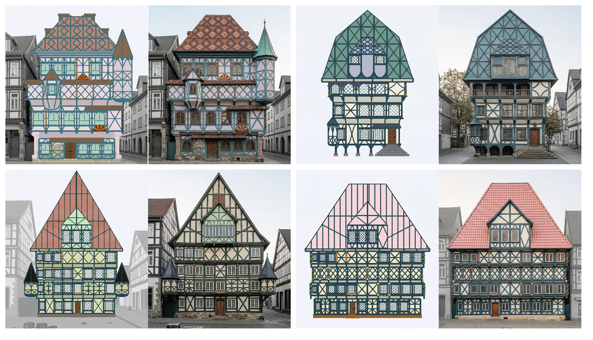
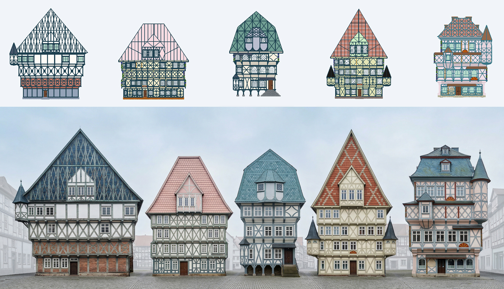
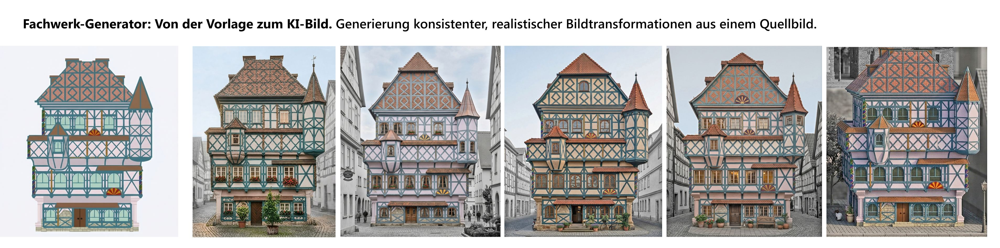

# FassadenSchmied: Fachwerk-Generator 🏡

> 🇬🇧 **Note for English speakers:** **[Fachwerkgenerator.de](https://fachwerkgenerator.de)**  is a browser-based, open-source tool for the visual design, exploration, and conceptualization of harmonious timber-framed structures. It is part of the architectural aesthetics project FassadenSchmied. The interface and documentation of this tool are currently in German. Since it's a lightweight HTML application, it is recommended to use the browser's built-in translation feature (e.g., in Chrome or Edge) to translate the tool on the fly.

**[Fachwerkgenerator.de](https://fachwerkgenerator.de)** ist ein browserbasiertes Open-Source-Tool zur visuellen Gestaltung, Erforschung und Konzeption harmonischer Fachwerk-Strukturen. Es ist Teil des Architektur-Ästhetik-Projekts **FassadenSchmied**.

---

### 📸 Nach der Erstellung: Von der Skizze zum Rendering

 

 

---

### ✨ Features
* **Live-Generierung:** Anpassung von Reihen, Spalten, Balkendicke, Etagenhöhen und Überhängen in Echtzeit.
* **Architektonische Vielfalt:** Integration von Giebeln, Gauben (Fledermausgauben, Walmgauben etc.), Sockeln, Türen und Fensterstilen.
* **Farb- & Materialkontrolle:** Auswahl von typischen Fachwerk-Holzfarben sowie freie Definition von Putzfarben und Dachmaterialien.
* **Inspiration:** Ein Zufalls-Modus erzeugt prozedural generierte Fachwerk-Kombinationen als kreativen Startpunkt.
* **100% Client-Side:** Vollständige lokale Ausführung direkt im Webbrowser. Es werden keine Nutzer- oder Formulardaten an Server gesendet.

### ⚠️ Bekannte Limitierungen & Haftungsausschluss
Dieses Modul dient **ausschließlich der visuellen Gestaltung und Konzeptentwicklung**. 
* Es ersetzt **keine statische oder bauplanerische Prüfung**.
* Generierte Entwürfe sind visuelle Ideen, keine Baupläne.
* Es gibt keine Garantie für die durchweg korrekte Verwendung historischer architektonischer Fachbegriffe (z.B. "Wilder Mann", "Knaggen").

### 🚀 Nutzung & Lokale Installation
Da das Tool aus reinen HTML-Dateien besteht, ist keine Installation notwendig:
1. Die aktuellste, vollumfängliche Version ist direkt im Browser nutzbar unter: **[fachwerkgenerator.de](https://fachwerkgenerator.de)**
2. Für den Einstieg stehen reduzierte Basis-Versionen zur Verfügung:
   * [Demo 1: Minimal-Modul](https://fachwerkgenerator.de/demo-1.html)
   * [Demo 2: Erweitertes Basis-Modul](https://fachwerkgenerator.de/demo-2.html)
3. Für die Offline-Nutzung können die HTML-Dateien unter [Releases](https://github.com/maxliebscher/FachwerkGenerator/releases) heruntergeladen und per Doppelklick im Webbrowser geöffnet werden.

### 🤝 Ergebnisse teilen
Erstellte Entwürfe oder daraus resultierende KI-Architektur-Renderings können gerne auf Social Media geteilt werden.
Zugehörige Hashtags: **#fassadenschmied** und **#fachwerkgenerator** (Mention: **@fassadenschmied**).

### 📄 Lizenz & Namensnennung
Dieses Projekt steht unter der **MIT Lizenz** und ist frei verwendbar, auch für Weiterentwicklungen (Forks). 
**Einzige Bedingung:** Bei Nutzung, Veröffentlichung von generierten Bildern in offiziellem Kontext oder Weiterentwicklung des Codes ist eine Namensnennung zwingend erforderlich (z. B. *"Erstellt mit dem Fachwerk-Generator von Maximilian Georg Liebscher / FassadenSchmied"*). Details siehe `LICENSE`.