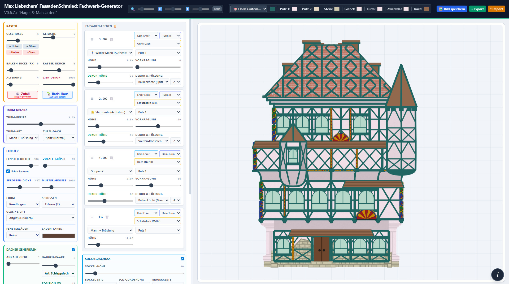
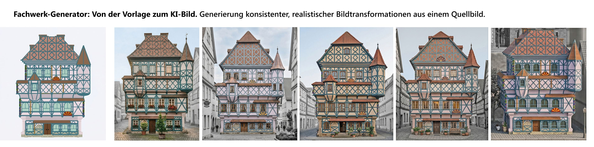
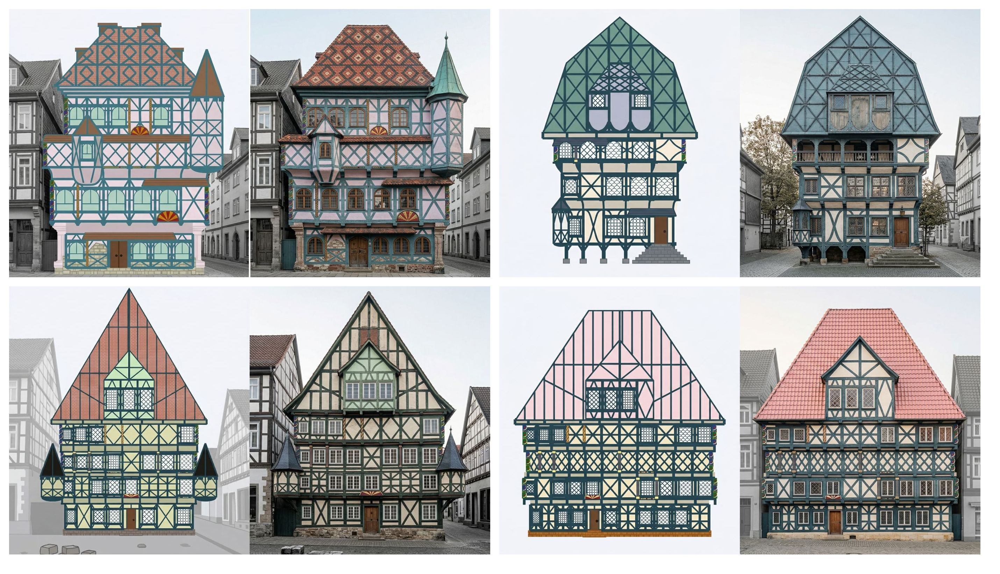
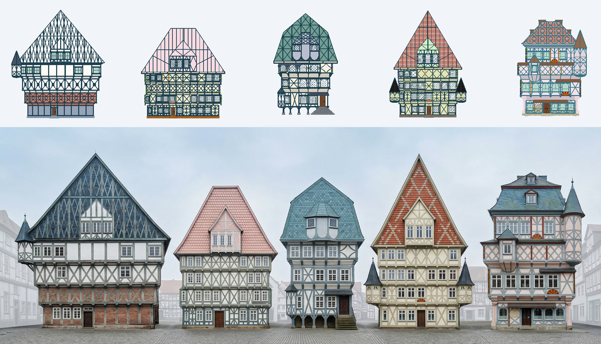

# FassadenSchmied: Fachwerk-Generator 🏡

> 🇬🇧 **English version:** The generator includes a carefully translated English interface at **[fachwerkgenerator.de/en/](https://fachwerkgenerator.de/en/)**. The language can also be changed directly in the toolbar.

**[Fachwerkgenerator.de](https://fachwerkgenerator.de)** ist ein browserbasiertes Open-Source-Tool zur visuellen Gestaltung, Erforschung und Konzeption harmonischer Fachwerk-Strukturen. Es ist Teil des Architektur-Ästhetik-Projekts **FassadenSchmied**.

---
### 💻 Screenshot aus dem Generator

  

### 📸 Nach der Erstellung: Von der Skizze zum Rendering

  

  
  

---

### ✨ Features
* **Live-Generierung:** Anpassung von Reihen, Spalten, Balkendicke, Etagenhöhen und Überhängen in Echtzeit.
* **Architektonische Vielfalt:** Integration von Giebeln, Gauben (Fledermausgauben, Walmgauben etc.), Sockeln, Türen und Fensterstilen.
* **Farb- & Materialkontrolle:** Auswahl von typischen Fachwerk-Holzfarben sowie freie Definition von Putzfarben und Dachmaterialien.
* **Inspiration:** Ein Zufalls-Modus erzeugt prozedural generierte Fachwerk-Kombinationen als kreativen Startpunkt.
* **100% Client-Side:** Vollständige lokale Ausführung direkt im Webbrowser. Es werden keine Nutzer- oder Formulardaten an Server gesendet.

### ⚠️ Bekannte Limitierungen & Haftungsausschluss
Dieses Modul dient **ausschließlich der visuellen Gestaltung und Konzeptentwicklung**. 
* Es ersetzt **keine statische oder bauplanerische Prüfung**.
* Generierte Entwürfe sind visuelle Ideen, keine Baupläne.
* Es gibt keine Garantie für die durchweg korrekte Verwendung historischer architektonischer Fachbegriffe (z.B. "Wilder Mann", "Knaggen").

### 🚀 Nutzung & Lokale Entwicklung
1. Die aktuellste, vollumfängliche Version ist direkt im Browser nutzbar unter: **[fachwerkgenerator.de](https://fachwerkgenerator.de)**
2. Für den Einstieg stehen reduzierte Basis-Versionen zur Verfügung:
   * [Demo 1: Minimal-Modul](https://fachwerkgenerator.de/demo-1.html)
   * [Demo 2: Erweitertes Basis-Modul](https://fachwerkgenerator.de/demo-2.html)
3. Für die lokale Entwicklung: `npm install`, danach `npm run dev`.
4. `npm run build` erzeugt die statisch hostbare Website in `dist/`. Wegen der gebündelten JavaScript-Module muss sie über einen Webserver ausgeliefert werden; das direkte Öffnen der Quell-`index.html` per Doppelklick wird nicht unterstützt.

### 🤝 Ergebnisse teilen
Erstellte Entwürfe oder daraus resultierende KI-Architektur-Renderings können gerne auf Social Media geteilt werden.
Zugehörige Hashtags: **#fassadenschmied** und **#fachwerkgenerator** (Mention: **@fassadenschmied**).

### 📄 Lizenz & Namensnennung
Dieses Projekt steht unter der **MIT Lizenz** und ist frei verwendbar, auch für Weiterentwicklungen (Forks). 
**Einzige Bedingung:** Bei Nutzung, Veröffentlichung von generierten Bildern in offiziellem Kontext oder Weiterentwicklung des Codes ist eine Namensnennung zwingend erforderlich (z. B. *"Erstellt mit dem Fachwerk-Generator von Maximilian Georg Liebscher / FassadenSchmied"*). Details siehe `LICENSE`.
